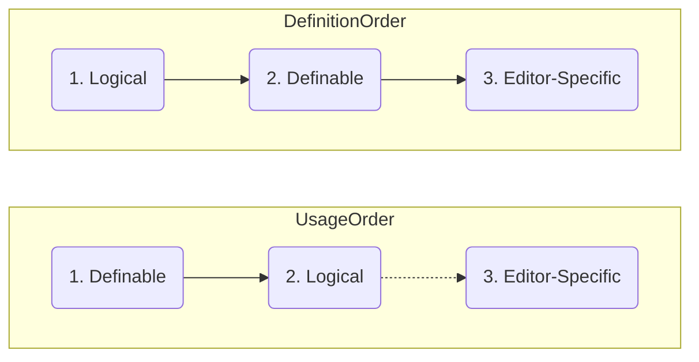
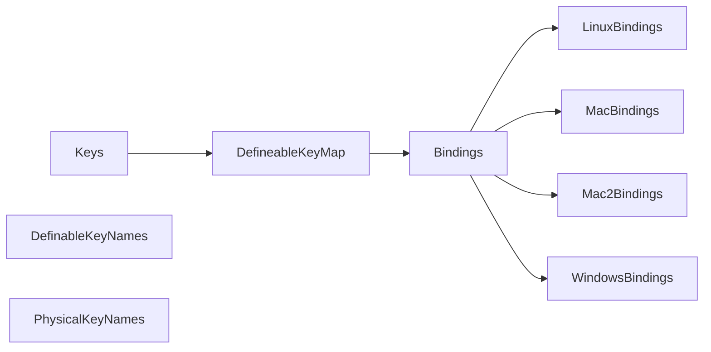
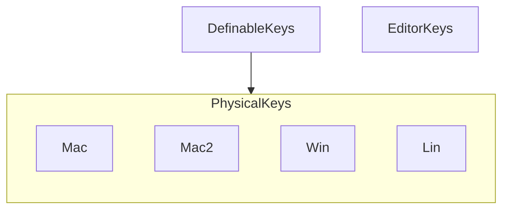

# Keys
  
The keys package is responsible for identifying the specific keys on the keyboard,
which the common strokes will be translated into.
    
## Goals for Package   
Have strokes specify definable keys which can be translated to platform-specific keys.
- We want to specify/input keys like <kbd>pinky</kbd>, <kbd>thumb</kbd>, <kbd>hyper</kbd>
- We want to output keys like <kbd>super</kbd>, <kbd>ctrl</kbd>, <kbd>alt</kbd> from the these definitions
 
### Special constraints
- consistent key ordering (as git maintainer), e.g. modifiers before non-modifiers
- hyper key support (pseudo-hyper) = capslock = super+ctrl+alt

### Future considerations
- Function Keys
- International Keyboards
- QMK support
- External Devices, Macros
- Import translations 
- Context-specific options
- Left/Right Options

## Definitions
- **Logical Keys** are the keys you actually press, they: 
  - are generalized, common names across platform
  - are applied to platforms, e.g. pinky->ctrl on win, pinky->cmd on mac
  - use expanded bindings, e.g. hyper->(super,alt,ctrl)
  - still receive editor-specific naming later on, e.g. Ctrl/Control
- **Definable Keys** are the key names that you specify in the strokes map,
  - are generalized, common names across platforms
  - include relative keys, e.g. pinky, thumb
  - include compound keys, e.g. hyper
  - include the logical keys as well    

   
 

                                           

